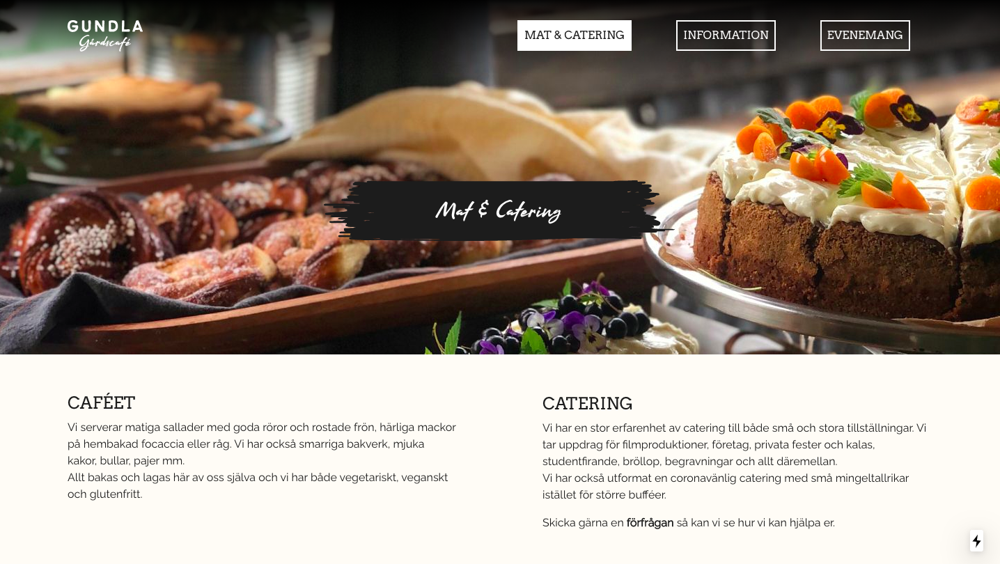

# Gundlagårdscafe

## About This Project

This is a group project completed by a team of Digital Designers and Web Developers from Yrgo. It is a responsive website for Gundlagårdscafe, a forest cafe beside the Delsjön national park in Gothenburg.

The website is built using JavaScript framework Next.JS connected to a headless Sanity CMS.

## Experience the website

- The website is live at [Vercel](http://gundlagardscafe-grupp5.vercel.com).

## Designers and Developers

- Alexander Gustafsson Flink - Web Developer
- Daniel Thorsen - Web Developer
- Dominic Kersch - Web Developer
- Tobias Lilja - Digital Design
- Anton Henricson - Digital Design
